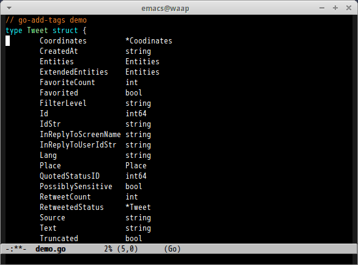

# go-add-tags.el [![travis badge][travis-badge]][travis-link] [![melpa badge][melpa-badge]][melpa-link] [![melpa stable badge][melpa-stable-badge]][melpa-stable-link]

Add field tags for struct fields. This package is inspired by `GoAddTags` of [vim-go](https://github.com/fatih/vim-go).

## Screencast



## Installation

`go-add-tags` is available on [MELPA](https://melpa.org/) and [MELPA stable](https://stable.melpa.org/)

You can install `go-add-tags` with the following command.

<kbd>M-x package-install [RET] go-add-tags [RET]</kbd>

## Interfaces

##### `go-add-tags`

Insert tag at current line. You can input multiple tags at once by comma, like `json,yaml`.
If region is enabled, then tags are inserted in lines in region. And `current-prefix-key` is specified,
then you can choose field style function.

## Customization

##### `go-add-tags-style`(Default: 'snake-case)

How to convert field in tag from field name.

- `snake-case`
- `lower-camel-case`
- `upper-camel-case`
- `original`

## Sample Configuration

``` emacs-lisp
(custom-set-variables
 '(go-add-tags-style 'lower-camel-case))

(with-eval-after-load 'go-mode
  (define-key go-mode-map (kbd "C-c t") #'go-add-tags))
```

[travis-badge]: https://travis-ci.org/syohex/emacs-go-add-tags.svg
[travis-link]: https://travis-ci.org/syohex/emacs-go-add-tags
[melpa-link]: https://melpa.org/#/go-add-tags
[melpa-stable-link]: https://stable.melpa.org/#/go-add-tags
[melpa-badge]: https://melpa.org/packages/go-add-tags-badge.svg
[melpa-stable-badge]: https://stable.melpa.org/packages/go-add-tags-badge.svg
